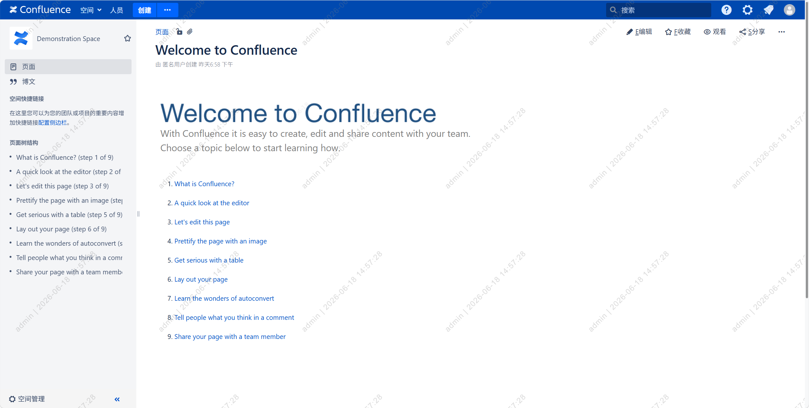

# Confluence Watermark Plugin

Confluence 7.13.3 水印插件，用于在页面、PDF 导出、ZIP 批量下载中嵌入水印，支持禁用 Word 导出，便于信息泄露追溯。

## 效果截图



## 功能列表

| 功能 | 实现方式 | 状态 |
|------|----------|------|
| 页面水印 | JS 注入 + CSS overlay | ✅ |
| 禁用 Word 导出 | JS 隐藏并拦截导出链接 | ✅ |
| PDF 导出水印 | Servlet Filter + PDFBox | ✅ |
| PDF 附件下载水印 | Servlet Filter + PDFBox | ✅ |
| ZIP 批量下载水印 | Servlet Filter + ZipInputStream/OutputStream | ✅ |
| 页面防篡改 | MutationObserver + 双层水印 + 定时巡检 | ✅ |

## 实现机制

### 1. 页面水印

**原理：** 通过 `web-resource` 将 JS 注入到 `viewcontent` context batch 中，页面加载时 JS 从 `<meta name="ajs-remote-user">` 获取当前用户名，动态创建水印 overlay DOM。

```
atlassian-plugin.xml
  └── web-resource (context: viewcontent)
        └── watermark.js → 注入到 context batch
```

**关键代码：**
- 从 `meta[name="ajs-remote-user"]` 获取用户名（备用 `data-username` 属性）
- 用户名经过 HTML 转义防止 XSS
- 生成 `username | timestamp` 格式水印文本
- 创建固定定位的 overlay，用 300px 间距的网格铺满页面
- 每个水印文本 `rotate(-45deg)` 旋转，透明度 15%

### 2. 禁用 Word 导出

**原理：** JS 扫描页面中所有 Word 导出链接（`href*="exportWord"`、`data-content-type="word"`、`#export-to-word-link`），设置 `display:none !important` 隐藏。

### 3. PDF/ZIP 下载水印

**原理：** 注册 Servlet Filter 拦截下载请求，用 `WatermarkResponseWrapper` 捕获原始响应，对内容添加水印后返回。

```
请求 → WatermarkExportFilter
         ├── PDF 请求 → PdfWatermarkProcessor.addWatermark()
         └── ZIP 请求 → ZipWatermarkProcessor.addWatermark()
```

**URL 匹配：**
```xml
<url-pattern>/spaces/flyingpdf/*</url-pattern>      <!-- 页面导出PDF -->
<url-pattern>/pages/exportpage.action</url-pattern>  <!-- 页面导出 -->
<url-pattern>/download/*</url-pattern>               <!-- 附件下载 -->
<url-pattern>/rest/api/*/download/*</url-pattern>    <!-- REST API下载 -->
```

**页面导出 PDF 特殊处理：** Confluence 页面导出 PDF 是两步流程：
1. `GET /spaces/flyingpdf/pdfpageexport.action` → 302 重定向
2. `GET /download/temp/pdfexport-xxx/filename.pdf` → 实际 PDF 内容

Filter 需同时匹配两个 URL。

### 4. PDF 水印实现

使用 PDFBox 2.0.24（Confluence 内置）：
- 遍历每页，创建 `PDPageContentStream`
- 设置 `PDExtendedGraphicsState` 控制透明度（15%）
- 通过 `setTextMatrix` 旋转 45° 绘制水印文本
- 使用 `try-finally` 确保 `PDDocument` 正确关闭

**坐标系注意：** PDF 坐标系原点在左下角，Y 轴向上，旋转方向与 CSS 相反。CSS 用 `-45deg`，PDF 用 `+45deg`。

### 5. ZIP 水印实现

- `ZipInputStream` 逐条解压
- 根据文件扩展名判断类型，调用 PDF 处理器
- 保留原始 entry 的时间戳和注释
- `ZipOutputStream` 重新打包
- ZIP 炸弹防护：单文件 100MB 上限 + 最多 10000 条目

### 6. 页面防篡改

**问题：** 早期版本可通过 F12 开发者工具删除水印 div 节点去除水印。

**防护机制：**

| 机制 | 说明 |
|------|------|
| 双层水印 | `documentElement` + `body` 各挂载一层，删一层还有一层 |
| MutationObserver | 监听 DOM 变化，水印被删除/修改时立即重建 |
| 定时巡检 | 每 2 秒检测水印是否存在，丢失则重建 |
| 属性监听 | 监听 `style`/`class`/`data-wm` 属性变化 |
| `!important` | 所有样式强制优先级，防止被 CSS 覆盖 |
| `data-wm` 标记 | 统一标记方便识别和重建 |
| z-index 最大值 | `2147483647` 确保在最顶层 |

**关键实现：**

```javascript
// 1. 双层挂载
document.documentElement.appendChild(layer1);  // html 根节点
document.body.appendChild(layer2);              // body 节点

// 2. MutationObserver 实时监控
var observer = new MutationObserver(function(mutations) {
    // 检测删除操作
    if (mutation.removedNodes 包含 data-wm 元素) → 重建
    // 检测属性修改
    if (mutation.target 有 data-wm 且 style/class 被改) → 重建
});

// 3. 定时巡检兜底
setInterval(function() {
    if (!document.querySelector('[data-wm]')) → 重建
}, 2000);
```

### 7. 性能优化

**URI 缓存机制（LRU）：**
```java
// 使用 LinkedHashMap 实现 LRU 缓存，上限 1000 条
private static final Map<String, Byte> ROUTE_CACHE = new LinkedHashMap<>(16, 0.75f, true) {
    protected boolean removeEldestEntry(Map.Entry<String, Byte> eldest) {
        return size() > 1000;
    }
};

// 缓存类型
TYPE_SKIP = 0;  // 跳过的 URI
TYPE_PDF  = 1;  // PDF 处理
TYPE_ZIP  = 2;  // ZIP 处理
```

首次请求进行完整判断，后续请求直接命中缓存跳过 filter 逻辑。

**大小限制：** 超过 50MB 的文件跳过水印处理，避免 OOM。

## 项目结构

```
confluence-watermark-plugin/
├── pom.xml
├── README.md
└── src/main/
    ├── java/com/example/watermark/
    │   ├── WatermarkExportFilter.java       # Servlet Filter 入口（LRU 缓存）
    │   ├── PdfWatermarkProcessor.java        # PDF 水印处理（PDFBox）
    │   ├── ZipWatermarkProcessor.java        # ZIP 水印处理
    │   └── WatermarkResponseWrapper.java     # 响应捕获包装器
    └── resources/
        ├── atlassian-plugin.xml              # 插件描述符
        └── js/watermark.js                   # 页面水印 JS（防篡改）
```

## 构建部署

```bash
mvn clean package -DskipTests
```

通过 Confluence 管理页面上传 JAR：
`http://<host>:8090/plugins/servlet/upm` → Upload Plugin

## 踩过的坑

### 1. Maven 构建超时

**现象：** `mvn package` 持续超时，无法完成。

**原因：** Atlassian 仓库在国外，国内访问极慢。

**解决：** 配置阿里云 Maven 镜像，排除 Atlassian 仓库：
```xml
<!-- ~/.m2/settings.xml -->
<mirrors>
  <mirror>
    <id>aliyunmaven</id>
    <mirrorOf>*,!atlassian-public</mirrorOf>
    <url>https://maven.aliyun.com/repository/public</url>
  </mirror>
</mirrors>
```

### 2. 缺少 OSGi MANIFEST.MF

**现象：** 插件安装后状态为 `enabled: false`，无法启用。

**原因：** Maven 构建的 JAR 缺少 OSGi Bundle 头信息，Confluence 不识别。

**解决：** 手动打包时添加 MANIFEST.MF：
```
Bundle-ManifestVersion: 2
Bundle-SymbolicName: com.example.confluence.confluence-watermark-plugin
Bundle-Version: 1.0.0
Atlassian-Plugin-Key: com.example.confluence.confluence-watermark-plugin
```

### 3. web-panel 模块无法启用

**现象：** 插件已启用，但 web-panel 模块 `enabled: false`。

**原因：** `atl.general` 等 location 在 Confluence 7.13.3 中不存在或不可用。

**解决：** 放弃 web-panel，改用 `web-resource` + `context: viewcontent` 方案，通过 JS 动态注入水印。

### 4. 页面水印用户名显示为 "user"

**现象：** 水印文本显示 `user | 2026-06-17 23:00:00`。

**原因：** JS 从 `#user-menu-link span` 获取文本，匹配到了无关文本。

**解决：** 改为从 `<meta name="ajs-remote-user" content="admin">` 获取用户名。

### 5. SimpleDateFormat 线程安全问题

**现象：** 并发访问时日期格式化结果异常或抛出 `NumberFormatException`。

**原因：** `SimpleDateFormat` 非线程安全，多线程共享同一实例会导致数据错乱。

**解决：** 改用 `ThreadLocal<SimpleDateFormat>`：
```java
private static final ThreadLocal<SimpleDateFormat> DATE_FORMAT =
    ThreadLocal.withInitial(() -> new SimpleDateFormat("yyyy-MM-dd HH:mm:ss"));
```

### 6. PDDocument 资源泄漏

**现象：** 长时间运行后内存持续增长。

**原因：** PDFBox 的 `PDDocument` 异常时未关闭。

**解决：** 使用 `try-finally` 确保关闭：
```java
PDDocument document = null;
try {
    document = PDDocument.load(...);
    // ...
} finally {
    if (document != null) document.close();
}
```

### 7. 页面导出 PDF 无水印

**现象：** 页面导出 PDF 没有水印，但附件 PDF 有。

**原因：** 页面导出 PDF 是两步流程（302 重定向到 `/download/temp/...`），Servlet Filter URL 模式未匹配重定向后的 URL。

**解决：** 添加 `/spaces/flyingpdf/*` 和 `/download/*` URL 模式。

### 8. PDF 水印方向与页面不一致

**现象：** PDF 水印倾斜方向与页面水印相反。

**原因：** PDF 坐标系原点在左下角（Y 轴向上），CSS 坐标系原点在左上角（Y 轴向下），旋转方向相反。

**解决：** CSS 用 `-45deg`，PDF 用 `+45deg`。

### 9. URL 匹配范围过宽导致性能问题

**现象：** 担心 `/download/*` 拦截所有下载请求。

**分析：** Servlet URL pattern `/download/*` 只匹配以 `/download/` 开头的路径，不匹配 `/s/.../download/contextbatch/...` 等 CDN 路径。实际影响有限。

**优化：** 添加 LRU 缓存，非水印 URI 直接跳过。

### 10. 页面水印可通过 F12 删除

**现象：** 通过浏览器开发者工具删除水印 div 节点即可去除水印。

**原因：** 早期版本只有单层水印 overlay，无防篡改机制。

**解决：** 实现多层防护（详见"页面防篡改"章节）。

### 11. ZIP 请求被错误缓存为 PDF 处理

**现象：** ZIP 下载的 URI 被缓存后，后续请求错误地调用 PDF 处理器。

**原因：** 缓存使用 `Boolean` 类型，无法区分 PDF 和 ZIP。

**解决：** 缓存改为 `Byte` 类型，记录处理类型（TYPE_SKIP/TYPE_PDF/TYPE_ZIP）。

### 12. 原型方法污染影响全局

**现象：** 覆盖 `Element.prototype.removeChild` 和 `setAttribute` 可能导致其他插件异常。

**原因：** 原型方法拦截影响所有 DOM 操作。

**解决：** 移除原型拦截，仅依赖 MutationObserver + 定时器。

### 13. XSS 风险

**现象：** 用户名通过 `innerHTML` 插入，未转义。

**原因：** `ajs-remote-user` meta 标签内容可能包含 HTML。

**解决：** 使用 `escapeHtml()` 函数转义后再插入。

## 依赖版本

| 依赖 | 版本 | 说明 |
|------|------|------|
| Confluence | 7.13.3 | 目标平台 |
| PDFBox | 2.0.24 | Confluence 内置 |
| Java | 11 | 编译版本 |
| Servlet API | 3.1.0 | Confluence 内置 |
| SLF4J | 1.7.25 | Confluence 内置 |
| atlassian-user | 3.0 | Confluence 内置 |

## 水印样式参数

| 参数 | 值 | 说明 |
|------|-----|------|
| 透明度 | 15% | JS/PDF 统一 |
| 旋转角度 | -45° (CSS) / +45° (PDF) | 因坐标系不同 |
| 字体 | Arial / Helvetica | 各平台可用字体 |
| 字号 | 16px (页面) / 14pt (PDF) | - |
| 间距 | 300px (页面) | 网格铺满 |
| 颜色 | rgb(128,128,128) | 灰色 |

## 致谢

感谢 **Xiaomi MiMo Orbit - 百万亿 Token 创造者激励计划**，本项目代码全部由 **MiMo-V2.5-Pro** 和 **MiMoCode** 生产。
